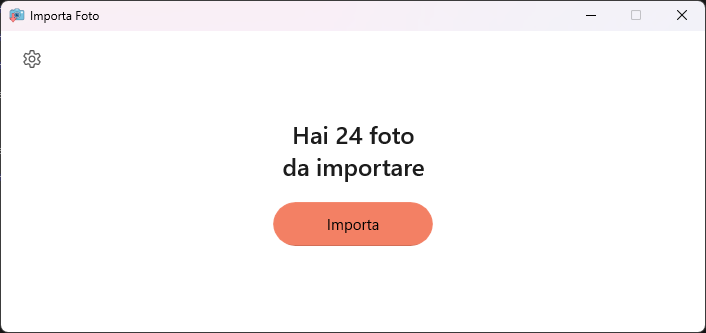
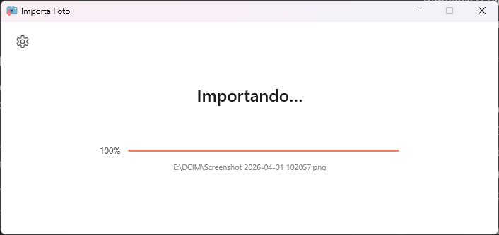
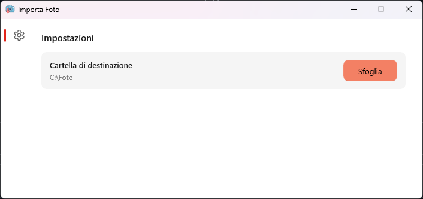

# 📷 Importa Foto

**Importa Foto** è una semplice app per Windows pensata per il nonno — collega la fotocamera via USB e importa tutte le foto nuove con un solo click, senza duplicati.



---

## ✨ Funzionalità

- **Rilevamento automatico** della fotocamera — nessun percorso da inserire
- **Nessun duplicato** — confronta i file già presenti e salta quelli copiati in precedenza
- **Cartella di destinazione personalizzabile** dal pannello impostazioni
- **Ricorda le impostazioni** tra un avvio e l'altro
- **Interfaccia semplice e pulita** in stile Windows 11

---

## 📸 Screenshot

| Importazione in corso | Pannello impostazioni |
|:---:|:---:|
|  |  |

---

## 🚀 Installazione

> Si potrebbe semplicemente scaricare il file .msix dalle relases, ma dal momento che utilizzo certificati self-signed bisognerebbe abilitare la modalità sviluppatore e installare manualmente il certificato. Questo script automatizza il processo

Apri **PowerShell** come amministratore e incolla:

```powershell
irm https://raw.githubusercontent.com/Flavio-coding/importa-foto/main/installer.ps1 | iex
```

### Cosa fa l'installer

1. Richiede i permessi di amministratore tramite UAC
2. Abilita il sideload di app su Windows
3. Scarica l'ultima versione da GitHub
4. Installa il certificato self-signed
5. Installa l'app
6. Chiede se aggiungere un collegamento al Desktop

---

## 🗑️ Disinstallazione

Apri **PowerShell** come amministratore e incolla:

```powershell
irm https://raw.githubusercontent.com/Flavio-coding/importa-foto/main/uninstaller.ps1 | iex
```

Rimuove l'app, il certificato e il collegamento dal Desktop, e ripristina le impostazioni di Windows modificate durante l'installazione.

---

## 🖥️ Requisiti

- Windows 10 versione 1809 o superiore
- Windows 11 (consigliato)
- Connessione internet per l'installazione

---

## 📖 Come si usa

1. Collega la fotocamera al PC via USB
2. Apri **Importa Foto** dal menu Start o dal Desktop
3. Attendi il conteggio delle foto nuove
4. Premi **Importa**
5. Al termine puoi chiudere la finestra

> Per cambiare la cartella di destinazione, clicca l'icona ⚙️ in alto a sinistra.

---

## 🛠️ Build da sorgente

Requisiti: **Visual Studio 2022** con il workload *Sviluppo di applicazioni WinUI*.

```
git clone https://github.com/Flavio-coding/importa-foto.git
```

---

## 📄 Licenza

Distribuito sotto licenza MIT. Vedi [`LICENSE`](LICENSE) per i dettagli.
